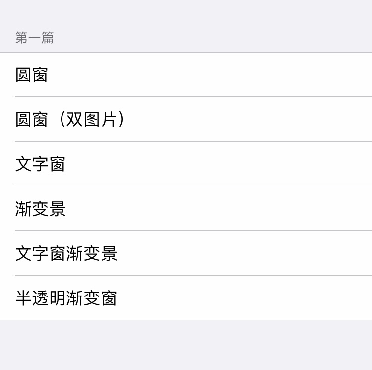

# WindowAndScenery
《iOS 动画 - 窗景篇》的示例代码库

#### 示例包含

#### 传送门
- SegmentFault：[iOS 动画 - 窗景篇（一）](https://segmentfault.com/a/1190000022833151)
- 简书： [iOS 动画 - 窗景篇（一）](https://www.jianshu.com/p/9ee143ba9d87)

